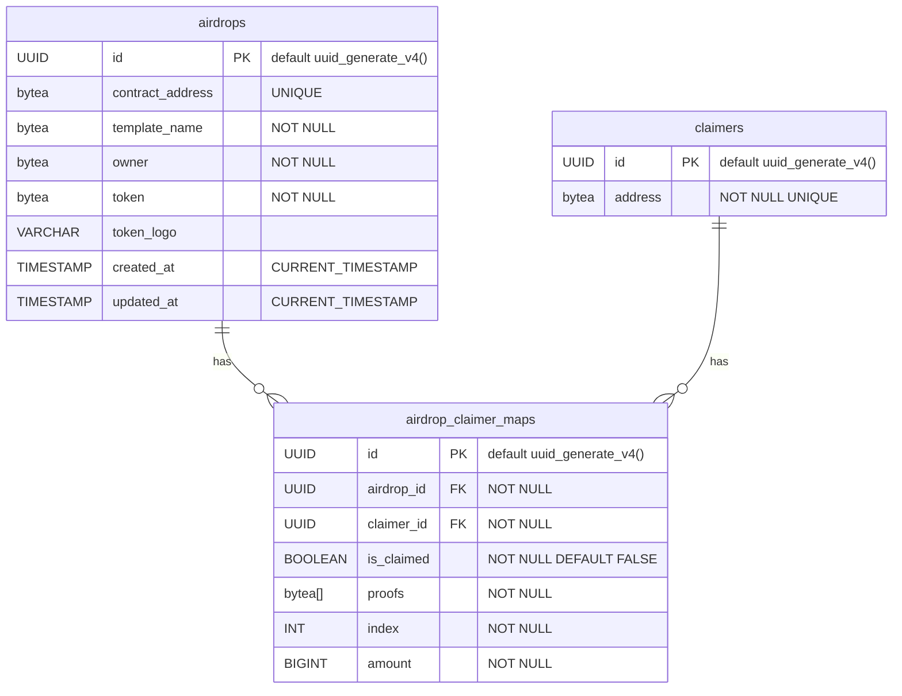
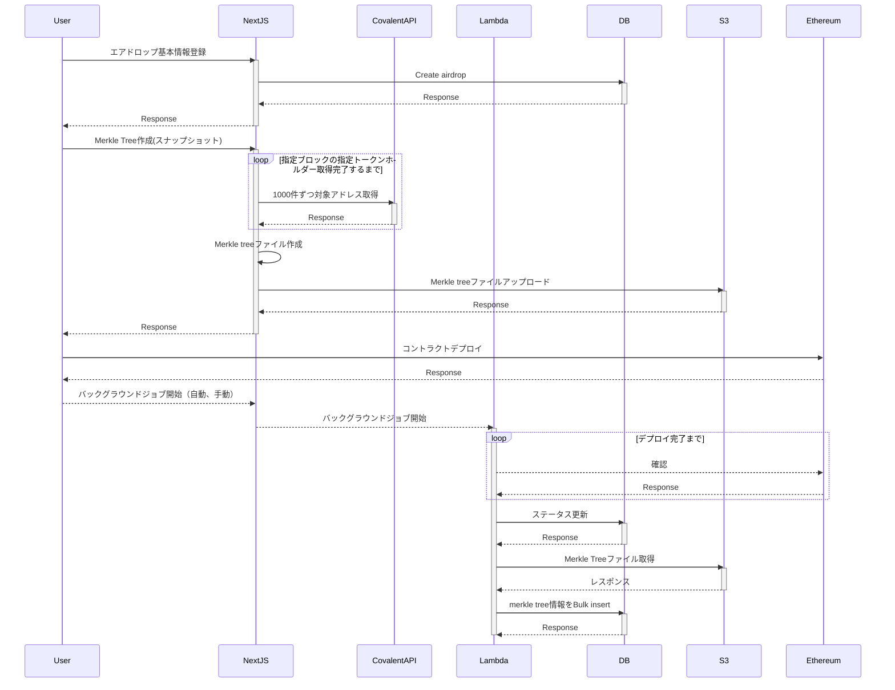

# Megumi interface

### ER Diagram

```mermaid
erDiagram
    airdrops {
        UUID id PK "default uuid_generate_v4()"
        bytea contract_address "UNIQUE"
        bytea template_name "NOT NULL"
        bytea owner "NOT NULL"
        bytea token "NOT NULL"
        VARCHAR token_logo
        TIMESTAMP created_at "CURRENT_TIMESTAMP"
        TIMESTAMP updated_at "CURRENT_TIMESTAMP"
    }

    claimers {
        UUID id PK "default uuid_generate_v4()"
        bytea address "NOT NULL UNIQUE"
    }

    airdrop_claimer_maps {
        UUID id PK "default uuid_generate_v4()"
        UUID airdrop_id FK "NOT NULL"
        UUID claimer_id FK "NOT NULL"
        BOOLEAN is_claimed "NOT NULL DEFAULT FALSE"
        bytea[] proofs "NOT NULL"
        INT index "NOT NULL"
        BIGINT amount "NOT NULL"
    }

    airdrops ||--o{ airdrop_claimer_maps : "has"
    claimers ||--o{ airdrop_claimer_maps : "has"

```

### Airdrop creation flow

```mermaid
sequenceDiagram
    participant User
    participant NextJS
    participant CovalentAPI
    participant Lambda
    participant DB
    participant S3
    participant Ethereum

    User->>NextJS: エアドロップ基本情報登録
    activate NextJS
    NextJS->>DB: Create airdrop
    activate DB
    DB-->>NextJS: Response
    deactivate DB
    NextJS-->>User: Response
    deactivate NextJS

    User->>NextJS: Merkle Tree作成(スナップショット)
    activate NextJS
    loop 指定ブロックの指定トークンホルダー取得完了するまで
        NextJS->>CovalentAPI: 1000件ずつ対象アドレス取得
        activate CovalentAPI
        CovalentAPI-->>NextJS: Response
        deactivate CovalentAPI
    end
    NextJS->>NextJS: Merkle treeファイル作成
    NextJS->>S3: Merkle treeファイルアップロード
    activate S3
    S3-->>NextJS: Response
    deactivate S3
    NextJS-->>User: Response
    deactivate NextJS

    User->>Ethereum: コントラクトデプロイ
    Ethereum-->>User: Response
    User-->>NextJS: バックグラウンドジョブ開始（自動、手動）
    NextJS-->>Lambda: バックグラウンドジョブ開始
    activate Lambda
    loop デプロイ完了まで
        Lambda-->>Ethereum: 確認
        Ethereum-->>Lambda: Response
    end
    Lambda->>DB: ステータス更新
    activate DB
    DB-->>Lambda: Response
    deactivate DB
    Lambda->>S3: Merkle Treeファイル取得
    activate S3
    S3-->>Lambda: レスポンス
    deactivate S3
    Lambda->>DB: merkle tree情報をBulk insert
    activate DB
    DB-->>Lambda: Response
    deactivate DB
    deactivate Lambda
```
