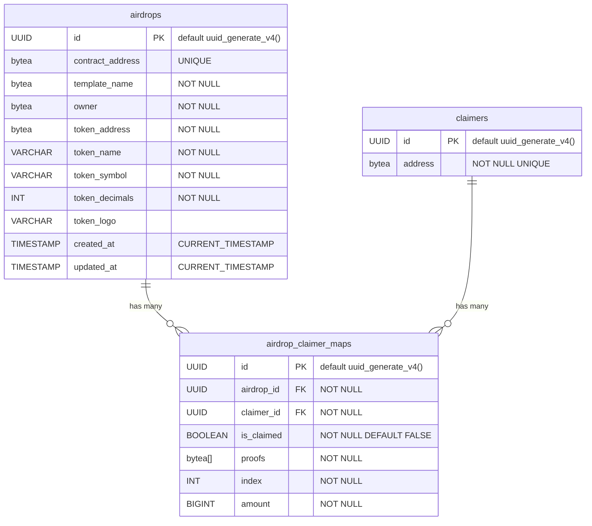
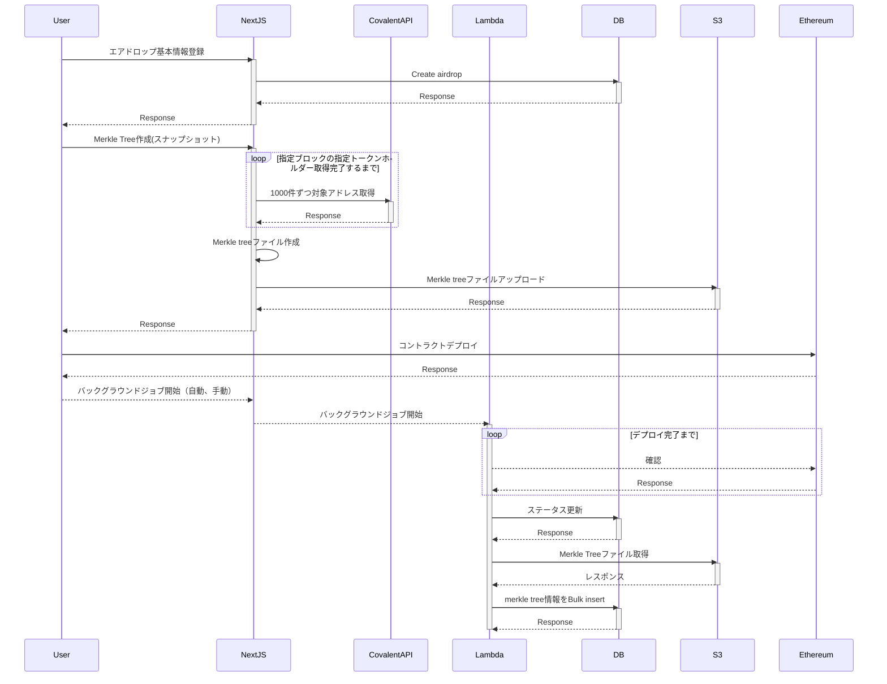

# Megumi interface

### ER Diagram

### Airdrop creation flow

### 機能一覧

● 一般ユーザ

- エアドロ一覧の閲覧

  - タイトル
  - トークンアドレス
  - トークン名
  - トークンロゴ
  - 対象アカウント数
  - 総エアドロ額
  - Claim 済件数

- エアドロ詳細の閲覧

  - タイトル
  - トークンアドレス
  - トークン名
  - トークンロゴ
  - 対象アカウント数
  - 総エアドロ額
  - Claim 済件数

- エアドロのクレーム
- 自分が対象のエアドロ一覧の取得
- 自分が対象のエアドロ詳細の閲覧

● エアドロ主催者

- ログイン / ログアウト
- 自エアドロ一覧の閲覧
- 自エアドロ詳細の閲覧
- 新規エアドロ登録
  - マークルツリーの登録（※3）
    - マークルツリー作成（&アップロード）
      - マニュアル
      - スナップショット
    - 既存のマークルツリーをアップロード（フォーマットのバリデーション必須）
    - オフチェーンデータ登録
      - タイトル
      - テンプレート
  - コントラクトの登録
    - コントラクトのデプロイ
      - token address の指定（標準 ERC20 を想定）
      - Merkle root の指定（オフチェーンデータから自動取得で編集不可）
      - テンプレートの指定（オフチェーンデータから自動取得で編集不可）
      - トークンのデポジット額の指定
    - 既存のコントラクトを紐づけ（※4）
- 自エアドロ編集
  - オフチェーンデータ編集
    - タイトル
    - マークルツリーの変更（コントラクトの登録前のみ）
    - テンプレート（コントラクトの登録前のみ）
  - コントラクトの編集
    - トークンのデポジット
    - トークンの引き出し

※3) オフチェーンデータ登録時に uuid 発行し、それを salt として create2 でコントラクトアドレス事前決定し紐づけておく。コントラクトのデプロイ時に salt を引数で渡す

※4) 直コンでデプロイされたコントラクトを紐づけたい場合のため。条件: Factory に登録済み && Merkle root, token address, テンプレートが合致 && オーナー && 他のエアドロに紐づいていない（オフチェーン）
